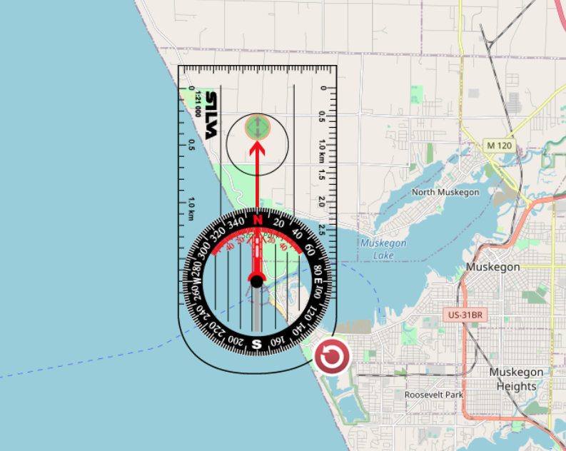

Lake Michigan Surf and Kite Project
================
Brice Kramer

``` r
library(readr)
GLOS_data_export_45161 <- read_csv("GLOS_data_export_45161.csv", skip = 1)
```

    ## 
    ## ── Column specification ────────────────────────────────────────────────────────
    ## cols(
    ##   `Date/Time (UTC)` = col_character(),
    ##   `Wind_Speed (kts)` = col_double(),
    ##   `Wind_Gust (kts)` = col_double(),
    ##   `Wind_from_Direction (degrees_true)` = col_double(),
    ##   `Water_Temperature_at_Surface (fahrenheit)` = col_double(),
    ##   `Significant_Wave_Height (ft)` = col_double(),
    ##   `Significant_Wave_Period (s)` = col_double(),
    ##   `significant_wave_from_direction (degrees_true)` = col_double(),
    ##   `Air_Temperature (fahrenheit)` = col_double(),
    ##   `Air_Pressure (mb)` = col_double(),
    ##   `Thermistor_String_at_1m (fahrenheit)` = col_double(),
    ##   `Thermistor_String_at_22m (fahrenheit)` = col_double()
    ## )

``` r
lake <- GLOS_data_export_45161
library(tidyverse)
```

    ## ── Attaching packages ─────────────────────────────────────── tidyverse 1.3.1 ──

    ## ✓ ggplot2 3.3.4     ✓ dplyr   1.0.7
    ## ✓ tibble  3.1.5     ✓ stringr 1.4.0
    ## ✓ tidyr   1.1.4     ✓ forcats 0.5.1
    ## ✓ purrr   0.3.4

    ## ── Conflicts ────────────────────────────────────────── tidyverse_conflicts() ──
    ## x dplyr::filter() masks stats::filter()
    ## x dplyr::lag()    masks stats::lag()

``` r
library(dplyr)
library(purrr)
library(lubridate)
```

    ## 
    ## Attaching package: 'lubridate'

    ## The following objects are masked from 'package:base':
    ## 
    ##     date, intersect, setdiff, union

#### Change to shorter column names

``` r
lake <- lake %>%
   rename(
     date_time = `Date/Time (UTC)`,
     wind_speed = `Wind_Speed (kts)`,
     wind_gust = `Wind_Gust (kts)`,
     wind_direction = `Wind_from_Direction (degrees_true)`,
     water_temp = `Water_Temperature_at_Surface (fahrenheit)`,
     wave_height = `Significant_Wave_Height (ft)`,
     wave_period = `Significant_Wave_Period (s)`,
     wave_direction = `significant_wave_from_direction (degrees_true)`,
     air_temp = `Air_Temperature (fahrenheit)`,
     air_pressure = `Air_Pressure (mb)`,
     therm_1m = `Thermistor_String_at_1m (fahrenheit)`,
     therm_22m = `Thermistor_String_at_22m (fahrenheit)`
   )
```

#### Add month and year columns

``` r
lake$date_time <- mdy_hm(lake$date_time)
 
 lake <- lake %>%
    mutate(as_datetime(date_time))
 
 lake <- lake %>%
    mutate(month(date_time, label = TRUE))
lake <- lake %>%
    rename(month_date = `month(date_time, label = TRUE)`)

lake <- lake %>%
   mutate(year(date_time)) 
lake <- lake %>%
  rename(year_date = `year(date_time)`)

    #check that the months and year converted
lake %>%
  select(date_time, month_date, year_date)%>%
  filter(is.na(month_date), is.na(year_date))
```

    ## # A tibble: 0 × 3
    ## # … with 3 variables: date_time <dttm>, month_date <ord>, year_date <dbl>

#### Finding missing and incorrect data

``` r
lake %>%
  summarise(meanWind = mean(wind_speed), minWind = min(wind_speed), maxWind = max(wind_speed))
```

    ## # A tibble: 1 × 3
    ##   meanWind minWind maxWind
    ##      <dbl>   <dbl>   <dbl>
    ## 1    -623. -19436.    194.

``` r
lake %>%
  filter(wind_speed >=0 & wind_speed < 194)%>%
  summarise(meanWind = mean(wind_speed), minWind = min(wind_speed), maxWind = max(wind_speed))
```

    ## # A tibble: 1 × 3
    ##   meanWind minWind maxWind
    ##      <dbl>   <dbl>   <dbl>
    ## 1     8.62       0    29.3

``` r
lake %>%
  summarise(meanWave = mean(wave_height), minWave = min(wave_height), maxWave = max(wave_height))
```

    ## # A tibble: 1 × 3
    ##   meanWave minWave maxWave
    ##      <dbl>   <dbl>   <dbl>
    ## 1   -6899. -32805.    328.

``` r
lake %>%
  filter(wave_height >=0 & wave_height < 30)%>%
  summarise(meanWave = mean(wave_height), minWave = min(wave_height), maxWave = max(wave_height))
```

    ## # A tibble: 1 × 3
    ##   meanWave minWave maxWave
    ##      <dbl>   <dbl>   <dbl>
    ## 1     1.39       0    12.5

#### Plot relationship between wind speed and wave size

``` r
wavewind <- lake %>%
  select(date_time, wind_speed, wave_height, wind_direction, wave_direction, month_date, year_date ) %>%
  filter(wind_speed >= 0 & wind_speed < 150, wave_height >= 0 & wave_height < 30, wind_direction >= 0 & wind_direction <= 360, wave_direction >=0 & wave_direction <= 360) %>%
  arrange(date_time)

ggplot(data = wavewind, mapping = aes(x = wind_speed, y = wave_height))+
  geom_point(size = .1)+
  geom_smooth()+
  labs(title = "Wind Speed vs. Wave Height")
```

    ## `geom_smooth()` using method = 'gam' and formula 'y ~ s(x, bs = "cs")'

<!-- -->

``` r
cor(wavewind$wind_speed, wavewind$wave_height)
```

    ## [1] 0.6870343

``` r
l_reg <- lm(data = wavewind, wave_height ~ wind_speed)
print(summary(l_reg))
```

    ## 
    ## Call:
    ## lm(formula = wave_height ~ wind_speed, data = wavewind)
    ## 
    ## Residuals:
    ##     Min      1Q  Median      3Q     Max 
    ## -3.7928 -0.5512 -0.1224  0.3648  9.5094 
    ## 
    ## Coefficients:
    ##               Estimate Std. Error t value Pr(>|t|)    
    ## (Intercept) -0.1801073  0.0081422  -22.12   <2e-16 ***
    ## wind_speed   0.1790032  0.0008386  213.46   <2e-16 ***
    ## ---
    ## Signif. codes:  0 '***' 0.001 '**' 0.01 '*' 0.05 '.' 0.1 ' ' 1
    ## 
    ## Residual standard error: 0.9007 on 50967 degrees of freedom
    ## Multiple R-squared:  0.472,  Adjusted R-squared:  0.472 
    ## F-statistic: 4.556e+04 on 1 and 50967 DF,  p-value: < 2.2e-16

#### Plot wave height based on wind direction , 270 is West

``` r
wavewind %>%
  select(wind_direction)%>%
  summarise(min = min(wind_direction), mean = mean(wind_direction), max = max(wind_direction))
```

    ## # A tibble: 1 × 3
    ##     min  mean   max
    ##   <dbl> <dbl> <dbl>
    ## 1     0  193.   360

``` r
ggplot(data = wavewind, mapping = aes(x = wind_direction, y = wave_height))+
  geom_point(size = .1)+
  geom_smooth()+
  labs(title = "Wind Direction vs. Wave Height")
```

    ## `geom_smooth()` using method = 'gam' and formula 'y ~ s(x, bs = "cs")'

<!-- -->

##### Notice clusters around 180 “S and SW winds” and 320 “NW winds”

-   this could be explained by more fetch distance across Lake Michigan.

<!-- Images of the beach angle at Muskegon -->
<!-- # ```{r images} -->
<!-- knitr::include_graphics('~/STA 518/Activities/LM-data/beach.png') -->
<!-- knitr::include_graphics('~/STA 518/Activities/LM-data/beach_full.png') -->
<!-- ``` -->

 

#### Graph monthly averages of wave height and wind speed

``` r
byMonthYear <- lake %>%
    select(date_time, month_date, year_date, wave_height, wind_speed)%>%
    filter(wave_height >=0 & wave_height < 30, wind_speed >= 0 & wind_speed < 100)%>%
    group_by(month_date, year_date)%>%
    summarise(waveH = mean(wave_height), windS = mean(wind_speed))
```

    ## `summarise()` has grouped output by 'month_date'. You can override using the `.groups` argument.

``` r
    # Doing the same thing with already filtered subset, Wave 
wavewind %>%
  select(date_time, month_date, year_date, wave_height, wind_speed)%>%
  group_by(month_date)%>%
  summarise(waveH = mean(wave_height), windS = mean(wind_speed))%>%
  ggplot(mapping = aes(x = month_date, y = waveH))+
    geom_bar(stat = 'identity')+
    labs(title = "Monthly Average Wave Height")
```

<!-- -->

``` r
    # Wind
wavewind %>%
  select(date_time, month_date, year_date, wave_height, wind_speed)%>%
  group_by(month_date)%>%
  summarise(waveH = mean(wave_height), windS = mean(wind_speed))%>%
  ggplot(mapping = aes(x = month_date, y = windS))+
    geom_bar(stat = 'identity')+
    labs(title = "Monthly Average Wind Speed")
```

<!-- -->

#### Graph monthly averages by year, show variation

``` r
byMonthYear %>%
  ggplot(mapping = aes(x = month_date,label=TRUE, abbr=TRUE, y = waveH, colour = year_date),
         group=factor(year_date))+
  geom_line() +
  geom_point() +
  labs(title = "Yearly Monthly Wave Height Averages", x="Month", y = "Wave Height")+
  theme_classic()
```

<!-- -->

``` r
  #by wind
byMonthYear %>%
  ggplot(mapping = aes(x = month_date,label=TRUE, abbr=TRUE, y = windS, colour = year_date),
         group=factor(year_date))+
  geom_line() +
  geom_point() +
  labs(title = "Yearly Monthly Wind Speed Averages", x="Month", y = "Wind Speed")+
  theme_classic()
```

<!-- -->

##### Here is a crazy graph of what I was really trying to do. I couldn’t figure out how to get the averages of each year at first.

``` r
lake %>%
  select(date_time, month_date, year_date, wave_height, wind_speed)%>%
  filter(wave_height >=0 & wave_height < 30, wind_speed >= 0 & wind_speed < 100)%>%
  group_by(month_date, year_date)%>%
  ggplot(mapping = aes(month(date_time, label=TRUE, abbr=TRUE), 
     group=factor(year(date_time)), y = wave_height, colour=factor(year(date_time)))) +
  geom_line() +
  geom_point() +
  labs(x="Month", y = "Wave Height", colour="Year") +
  theme_classic()
```

<!-- -->

#### Fixed

``` r
byMonthYear %>%
  ggplot(mapping = aes(x = month_date,label=TRUE, abbr=TRUE, y = waveH, colour = factor(year_date)),
         group=factor(year_date))+
  geom_line(aes(group = year_date)) +
  geom_point() +
  labs(title = "Monthly Average Wave Height by Year", x="Month", y = "Wave Height", color = "Year")+
  theme_classic()
```

<!-- -->

``` r
byMonthYear %>%
  ggplot(mapping = aes(x = month_date,label=TRUE, abbr=TRUE, y = windS, colour = factor(year_date)),
         group=factor(year_date))+
  geom_line(aes(group = year_date)) +
  geom_point() +
  labs(title = "Monthly Average Wind Speed by Year", x="Month", y = "Wave Height", color = "Year")+
  theme_classic()
```

<!-- -->

### Focusing on wind data for kiting

``` r
wind <- tibble(lake[,c(1:4,14,15)]) %>%
  filter(wind_speed >= 0 & wind_speed < 194)
wind_clean <- wind %>% 
  filter(wind_gust != -19436.45616, wind_direction >= 0 & wind_direction <= 360)

wind_clean %>%
  summarise(min = min(wind_gust), mean = mean(wind_gust), max = max(wind_gust))
```

    ## # A tibble: 1 × 3
    ##     min  mean   max
    ##   <dbl> <dbl> <dbl>
    ## 1     0  10.1  41.3

``` r
  #add mph to wind             
wind <- wind %>%
  mutate(mph = wind_speed*1.15078)
```

#### Focusing on wave data

``` r
wave <- tibble(lake[,c(1,6:8, 14:15)])
#removing missing wave height and wave period
wave <- subset(wave, wave$wave_height!= -32805.11916 )
wave2 <- subset(wave, wave$wave_period != -9999 & wave$wave_direction != 0)

wave2 <- wave2 %>%
  filter(wave_direction >= 0 & wave_direction <= 360)

wave2 %>%
  summarize(mean(wave_period), min(wave_period), max(wave_period))
```

    ## # A tibble: 1 × 3
    ##   `mean(wave_period)` `min(wave_period)` `max(wave_period)`
    ##                 <dbl>              <dbl>              <dbl>
    ## 1                2.79               1.61                  6

``` r
wave2 %>%
  summarize(mean(wave_direction), min(wave_direction), max(wave_direction))
```

    ## # A tibble: 1 × 3
    ##   `mean(wave_direction)` `min(wave_direction)` `max(wave_direction)`
    ##                    <dbl>                 <dbl>                 <dbl>
    ## 1                   218.                  0.03                  328.

#### Surfable waves, notice missing data for November

``` r
surfWave <- subset(wave2, wave2$wave_height >= 2.5)
surfWave %>%
  ggplot(mapping = aes(x = month_date, y = wave_height))+
  geom_point(size = .1)+
  geom_smooth()
```

    ## `geom_smooth()` using method = 'gam' and formula 'y ~ s(x, bs = "cs")'

<!-- -->

``` r
surfWave %>%
  count(month_date)
```

    ## # A tibble: 8 × 2
    ##   month_date     n
    ##   <ord>      <int>
    ## 1 Apr            9
    ## 2 May           55
    ## 3 Jun          259
    ## 4 Jul          279
    ## 5 Aug          570
    ## 6 Sep         1124
    ## 7 Oct         1217
    ## 8 Nov           22

``` r
wave2 %>%
  count(month_date)
```

    ## # A tibble: 8 × 2
    ##   month_date     n
    ##   <ord>      <int>
    ## 1 Apr          320
    ## 2 May         3515
    ## 3 Jun         4074
    ## 4 Jul         3844
    ## 5 Aug         6238
    ## 6 Sep         4374
    ## 7 Oct         2706
    ## 8 Nov          130

``` r
wave %>%
  count(month_date)
```

    ## # A tibble: 10 × 2
    ##    month_date     n
    ##    <ord>      <int>
    ##  1 Mar          338
    ##  2 Apr         1770
    ##  3 May         8678
    ##  4 Jun         9403
    ##  5 Jul         8207
    ##  6 Aug        10878
    ##  7 Sep         8754
    ##  8 Oct         6470
    ##  9 Nov          820
    ## 10 Dec           43

#### Here are “ideal” surfing conditions for somewhere like Maui or California. These conditions are very rare in Michigan. We take any waves.

``` r
surfIdeal <- wavewind %>%
  filter(wind_speed > 0 & wind_speed < 10, wave_height >= 2.5 & wave_height < 300)%>%
  arrange(desc(wave_height))
  
surfIdeal %>%  
  summarize(meanWave = mean(wave_height), minWave = min(wave_height),
            maxWave = max(wave_height), meanWind = mean(wind_speed),
            minWind = min(wind_speed), maxWind = max(wind_speed), count =  count(surfIdeal))
```

    ## # A tibble: 1 × 7
    ##   meanWave minWave maxWave meanWind minWind maxWind count$n
    ##      <dbl>   <dbl>   <dbl>    <dbl>   <dbl>   <dbl>   <int>
    ## 1     3.03    2.53    6.27     7.14  0.0365    10.0     856

``` r
surfIdeal %>%
  ggplot(mapping = aes(x = wind_speed, y = wave_height))+
  geom_point(size = .5)+
  labs(title = "Ideal Surf Conditions Wave vs Wind")
```

<!-- -->

``` r
surfIdeal %>%
  ggplot(mapping = aes(x = wind_speed, y = wave_height))+
  geom_bin2d()+
  labs(title = "Density Plot of Ideal Surf Conditions")
```

<!-- -->

``` r
surfIdeal %>%
  ggplot(mapping = aes(x = wind_direction, y = wave_height))+
  geom_point(size = .5)+
  labs(title = "Ideal surf conditions Wave vs Wind Direction")
```

<!-- -->

``` r
surfIdeal %>%
  select(date_time, month_date, year_date, wave_height, wind_speed)%>%
  group_by(month_date)%>%
  summarise(waveH = mean(wave_height), windS = mean(wind_speed))%>%
  ggplot(mapping = aes(x = month_date, y = waveH))+
  geom_bar(stat = 'identity')+
  labs(title = "Monthly Average Wave Height For Ideal Surf Conditions")
```

<!-- -->

``` r
surfIdeal %>%
  select(date_time, month_date, year_date, wave_height, wind_speed)%>%
  group_by(month_date)%>%
  summarise(waveH = mean(wave_height), windS = mean(wind_speed))%>%
  ggplot(mapping = aes(x = month_date, y = windS))+
  geom_bar(stat = 'identity')+
  labs(title = "Monthly Average Wind Speed For Ideal Surf Conditions")
```

<!-- -->

``` r
surfIdeal %>%
  select(month_date)%>%
  group_by(month_date)%>%
  count(month_date)%>%
  ggplot(mapping = aes(x = month_date, y = n))+
  geom_bar(stat = 'identity')+
  labs(title = "Monthly Number of Oberservations for Ideal Surfing")
```

<!-- -->

#### Ideal conditions for beginner kiters

``` r
kiteIdeal <- wavewind %>%
  filter(wind_speed > 12 & wind_speed <16 & wave_height < 2.5 & wind_direction > 140 & wind_direction < 340)
     #graph wind speeds for ideal kite conditions for beginners
kiteIdeal %>%
  ggplot(mapping = aes(x = wave_height, y = wind_speed))+
  geom_point(size = .5)+
  geom_smooth()+
  labs(title = "Ideal Kite Conditions Wave vs Wind")
```

    ## `geom_smooth()` using method = 'gam' and formula 'y ~ s(x, bs = "cs")'

<!-- -->

``` r
wind %>%
  filter(wind_speed > 12 & wind_speed <16 & wind_direction > 140 & wind_direction < 340)%>%
  ggplot(mapping = aes(x = wind_direction, y = wind_speed))+
  geom_point(size = .8)+
  labs(title = "Wind Direction of Ideal Kite Conditions")
```

<!-- -->

``` r
kiteIdeal %>%
  select(date_time, month_date, year_date, wave_height, wind_speed)%>%
  group_by(month_date)%>%
  count(month_date)%>%
  ggplot(mapping = aes(x = month_date, y = n))+
  geom_bar(stat = 'identity')+
  labs(title = "Number of Observations for Ideal Kiting")
```

<!-- -->

## Closing conclusions:

-   Wind speed and wave height have a positive correlation.  
-   Wind speed and wave height are both higher in the fall.  
-   There seems to be a pattern between wind direction and wave height
    possibly due to the fetch of the lake.  
    - “The maximum length of open water that wind can travel across”  
-   Most surfing occurs in the fall but those rare occasions of Maui
    like conditions may occur more frequently in the summer.  
-   Most kiting also occurs in the fall, but for beginners who need a
    decent amount of wind without too many waves, the summer is the best
    time to learn.  
-   Note: We would see much higher wind speed and wave height for early
    spring and late fall, we have missing data because the sensors
    cannot be in freezing conditions. I was more focused on fall vs
    summer months because the water temperature in the spring time is
    still near freezing. Water temperature in the fall is still warm
    from the summer.
